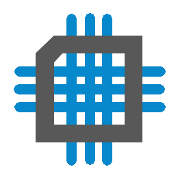
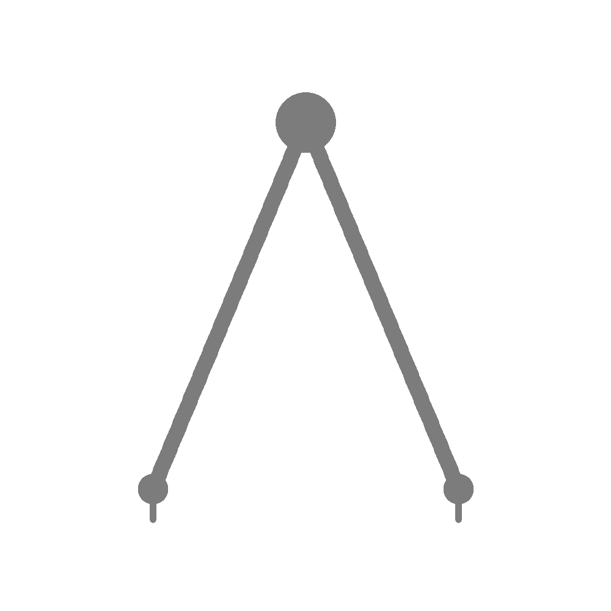

Technical Skills
================

Microcontrollers & Firmware
---------------------------

I generally prefer a layered architecture in order to reduce the mind share 
required to complete portions of an application.  This development
method often leads to code which emphasizes function over cyclic efficiency.

I have successfully deployed each of the below architectures into production:

 * PIC24/dsPIC33 series development in C, assembly
 * PIC10/12/16/18 series development in assembly
 * MSP430 series development in C 
 * STM32 series development in C

I have successfully deployed firmware implementing motor control algorithms,
communication protocols (RS-422, RS-485, wireless), and test hardware.  I 
have written safety-critical code, including full code documentation.

Electrical Engineering
-----------------------

I have been responsible for all aspectes of electrical design, from
schematic entry, component selection, through layout and cost
optimization.  Softwares that I have experience with:

 * OrCAD Schematic Entry
 * Cadence PCB Editor
 * `KiCAD <http://www.kicad-pcb.org/>`_ Schematic/Layout
 * Altium Schematic Entry
 * Familiarity with DO-178 software design activities 
 * Familiarity with design to meet DO-160 

Mechanical Engineering 
----------------------

I acquired a hobby of 3D printing during the early days of the rising
hobbyist 3D printing.  In addition, I had a mentor who allowed me to 
design mechanical parts and features that eventually made it into 
production giving me mechanical design skills.

I have been able to hone my initial skillset through product design and
tool design.

 * SolidWorks
 * `3D-printing <https://www.thingiverse.com/slightlynybbled/about>`_
 * Tool design
 * Drawings

.. image:: _static/images/office.png
    :width: 60px
    :height: 80px
    :alt: microcontroller logo
    :align: left

Office Productivity
*******************

The majority of report generation activities are conducted utilizing
MS Word or Word-like software.  I generally prefer to utilize styles
within the document structure as this leads to a highly maintainable
document which is inherently organized and beautifully exported to 
PDF.

 * MS Office Suite
   * Word
   * Excel
   * Powerpoint
   * OneNote
 * `LibreOffice <https://www.libreoffice.org/>`_ Suite

Software Development
--------------------

My introduction to software was as a firmware developer.  As I continued to develop 
my skills, I found it necessary to learn other languages in order to become a better
firmware developer.  Additionally, through that process, I was further exposed to 
different souce control and development methods which increased my productivity 
and value in my various roles.

Git
***

I manage a small number of open-source projects.  Most of these started out
as useful scripts that I found myself utilizing over and over.  None of the
projects have "taken off", but many of them have users and have merged 
pull requests on GitHub.  Amongst the git-related skills:

 * Routine command-line interaction (stage, commit, branch, merge)
 * Working with remotes (push, pull, fetch)
 * `GitHub <https://github.com/slightlynybbled>`_, including fork, pull requests
 * `Git Flow <https://www.atlassian.com/git/tutorials/comparing-workflows/gitflow-workflow>`_

C 
******

My skills in C have been primarily focused on microcontroller firmware 
development and not on application development.

.. image:: _static/images/python-logo.png
    :width: 60px
    :alt: python logo
    :align: left

Python 
******

Python as become a favored language for its extraordinary flexibility in 
a number of applications.  I have utilied Python for complimentary
testing applications, automated manufacturing testing, backend web
development, and data analysis.

 * `Sphinx <http://www.sphinx-doc.org/en/latest/>`_ - as evidenced by this document
 * `Pyserial <https://pythonhosted.org/pyserial/>`_ - `interfacing with hardware <https://github.com/slightlynybbled/di2008>`_; communication protocols
 * GUI
   * tkinter
   * Qt via `pyside6 <https://doc.qt.io/qtforpython-6/>`_
 * `Flask <https://palletsprojects.com/p/flask/>`_, including flask blueprints
 * Application deployment - no external dependencies
 * Automated test development for manufacturing environments
 * Jupyter Notebooks - utilized for basic data analysis
 * `PyTest <https://docs.pytest.org/en/latest/>`_ for automated software testing

.. image:: _static/images/www-logo.png
    :width: 60px
    :alt: www logo
    :align: left

Web
***

I have become familiar with JavaScript through experimentation and development
of some toy web sites.  I have implemented small web sites which interact with
hardware on such platforms as Raspberry Pi and similar.

 * `Jinja2 <https://jinja.palletsprojects.com/en/2.10.x/>`_ templates
 * Basic JavaScript
 * Basic Bootstrap

Misc 
----

 * Markdown
 * reStructured Text
 * Spaces, not tabs
 * GIMP (basic image manipulation)
